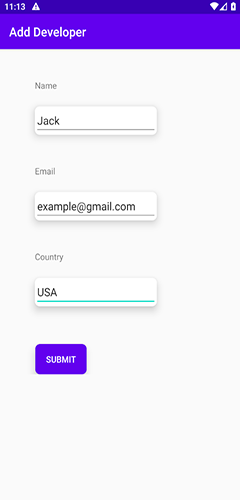
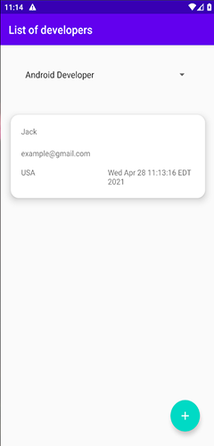
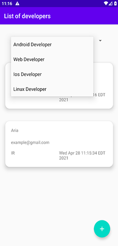

Sample clean architecture with mvvm
=================

This project is a simple example of how to implement the clean architecture and combine it with MVVM architecture to help you understand this architecture and how to run the unit tests.

Libraries Used
--------------

* [Data Binding][0] - Declaratively bind observable data to UI elements.
* [LiveData][1] - Build data objects that notify views when the underlying database changes.
* [Room][2] - Access your app's SQLite database with in-app objects and compile-time checks.
* [ViewModel][3] - Store UI-related data that isn't destroyed on app rotations. Easily schedule
asynchronous tasks for optimal execution.
* [Kotlin Coroutines][4] - for managing background threads with simplified code and reducing needs for callbacks
* [Dagger 2][5] -Dagger is a fully static, compile-time dependency injection framework for both Java and Android.
* [Junit][6] - JUnit is an open-source Unit Testing Framework for JAVA. It is useful for Java Developers to write and run repeatable tests.
* [Espresso][7] - The Espresso test framework. Espresso is a testing framework for Android to make it easy to write a reliable user interface.
* [Mockito][8] - Mockito is a popular mock framework which can be used in conjunction with JUnit. Mockito allows you to create and configure mock objects.

[0]: https://developer.android.com/topic/libraries/data-binding/
[1]: https://developer.android.com/topic/libraries/architecture/livedata
[3]: https://developer.android.com/topic/libraries/architecture/room
[4]: https://developer.android.com/topic/libraries/architecture/viewmodel
[5]: https://kotlinlang.org/docs/reference/coroutines-overview.html
[5]: https://dagger.dev/
[6]: https://developer.android.com/training/testing/junit-rules
[7]: https://developer.android.com/training/testing/espresso
[8]: https://site.mockito.org/

Screenshots
-----------

License
-------

Copyright [2021] [Aria rostami farah]

Licensed under the Apache License, Version 2.0 (the "License");
you may not use this file except in compliance with the License.
You may obtain a copy of the License at

    http://www.apache.org/licenses/LICENSE-2.0

Unless required by applicable law or agreed to in writing, software
distributed under the License is distributed on an "AS IS" BASIS,
WITHOUT WARRANTIES OR CONDITIONS OF ANY KIND, either express or implied.
See the License for the specific language governing permissions and
limitations under the License.

